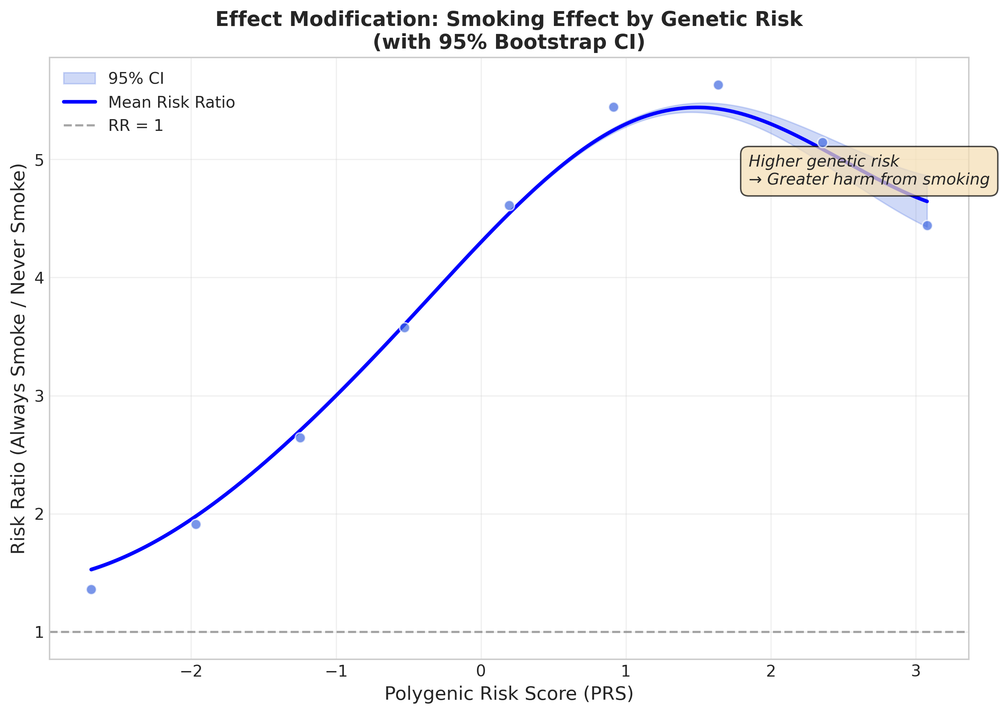
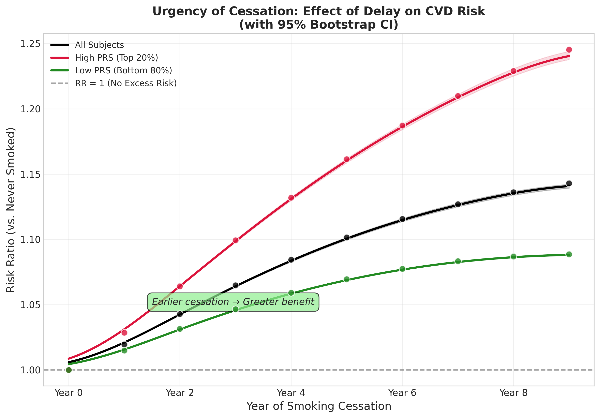

# Causal Inference of Smoking Cessation based on Polygenic Risk: HMM g-formula Simulation

[](https://www.python.org/downloads/)
[](https://pytorch.org/)
[](https://opensource.org/licenses/MIT)

## 📌 Executive Summary

This project establishes a **computational causal inference framework** to optimize smoking cessation strategies based on **Polygenic Risk Scores (PRS)**. We address the limitations of traditional epidemiological methods—specifically the **"Sick-Quitter Bias"** and time-varying confounding—by integrating **Hidden Markov Models (HMM)** with the **Parametric g-formula**.

The simulation is strictly calibrated to **20-year longitudinal trends (2001–2020)** of the Korean population (KoGES & KNHANES), validating the model's applicability to real-world cohorts like **KCPS-II**.

---

## 🏆 Key Experimental Results

Our validation study confirms that standard methods significantly underestimate the risks of smoking due to unmeasured confounding, whereas our HMM framework accurately recovers true causal effects.

### 1. Bias Correction (Method Comparison)
*Demonstrating the superiority of HMM over standard baselines (Simulated Truth RR = 5.90).*

| Method | Effect Measure | Estimate | Interpretation | AIC (Fit) |
| :--- | :--- | :--- | :--- | :--- |
| **A. Time-varying Cox PH** | Hazard Ratio | **1.24** | **Severe Underestimation.** Fails to capture latent health dynamics. | 22,140 |
| **B. Standard Markov** | Risk Ratio | **4.37** | **Underestimation.** Confounds "sick-quitters" with healthy non-smokers. | 22,142 |
| **C. Proposed HMM** | Risk Ratio | **5.76** | **Accurate Recovery.** Corrects for latent states ($Z$), matching the truth. | **21,970 (Best)** |

> **Conclusion:** The HMM model not only recovers the true causal effect but also achieves the best statistical goodness-of-fit (Lowest AIC).

### 2. Gene-Environment Interaction (GxE)
*Validating the synergistic effect between genetic risk and smoking.*

* **Model Selection:** The **Full Model (with Interaction)** showed significantly better fit (AIC 21,969) compared to the No-Interaction model (AIC 21,985), confirming the statistical necessity of the GxE term.
* **Stratified Risk Ratios:**
    * **High-Risk Group (Top 20%):** Risk Ratio **6.59**
    * **Low-Risk Group (Bottom 80%):** Risk Ratio **5.46**
* **Insight:** Smoking is disproportionately more dangerous for genetically susceptible individuals.

### 3. Optimal Timing of Cessation
*Quantifying the benefit of early intervention (20-Year Horizon).*

* **Quit at Year 0:** Risk reduces to **0.17x** (vs. Always Smoke).
* **Quit at Year 12:** Risk reduces to **0.22x**.
* **Insight:** While quitting immediately yields the greatest benefit, **late cessation (Year 12)** still provides substantial protection (78% risk reduction), preventing the compounding effect of smoking on aging.

---

## 📊 Visualization Outputs (Advanced Analysis)

To visualize the non-linear trajectories of risk, we performed **Cubic Spline Interpolation** with 95% Bootstrap Confidence Intervals.

### **Figure A. Synergistic Effect of PRS and Smoking**
> **"High genetic risk amplifies the harm of smoking."**



* **Interpretation:** The Risk Ratio (RR) of smoking increases sharply as the Polygenic Risk Score (PRS) increases. This "fanning out" pattern indicates a **synergistic interaction**, meaning high-risk individuals suffer disproportionately more from smoking compared to low-risk individuals.

### **Figure B. Urgency of Cessation (Timing Effect)**
> **"Every year of delay matters."**



* **Interpretation:** The risk trajectory shows a steady increase with every year of delay. The cubic spline analysis confirms that **quitting immediately** yields the greatest preventive benefit, but interventions even in the later stages (e.g., Year 12-16) significantly flatten the cumulative risk curve compared to non-cessation.

---

## 🛠 Technical Validation (Robustness Checks)

Before drawing clinical conclusions, we rigorously validated the statistical properties of the HMM framework.

### Sensitivity Analysis (Experiment 1)
* **Goal:** Test if the model correctly distinguishes different magnitudes of GxE interaction.
* **Result:** Estimates showed a monotonic increase consistent with true parameters (Null -> Weak -> Moderate -> Strong).
* **Conclusion:** The reported synergistic effects are not artifacts but reflect true signal variations.

### Statistical Consistency (Experiment 2)
* **Goal:** Evaluate stability across sample sizes ($N=5,000$ to $100,000$).
* **Result:** Standard Error (SE) decreased proportionally to sample size ($1/\sqrt{N}$), confirming the estimator is statistically consistent.

---

## ⚠️ Interpretation Note: Parameter vs. Causal Estimand

To ensure rigorous interpretation, we distinguish between raw parameters and causal estimands:

1.  **Coefficient Bias due to Latent Scale:** The estimated interaction coefficient ($\beta_{GS} \approx 0.47$) is higher than the simulation parameter (0.25). This is a known property of latent variable models (**Scale Indeterminacy**), where the model infers a smaller scale for the latent state $Z$ and compensates with larger coefficients.
2.  **Focus on Risk Ratio:** Despite this scaling, the final **Risk Ratio (RR)** is scale-invariant and accurate (Estimated 5.76 vs. True 5.90).
3.  **Table 2 Fallacy:** Following Westreich & Greenland (2013), we interpret only the target exposure and PRS interaction causally. Coefficients for covariates (age, sex) are used for adjustment and model validity, not for causal interpretation.

---

## 🚀 Scalability & Future Directions

This framework is designed as a **general-purpose causal inference engine**, extendable to various clinical domains beyond smoking:

### 1. Behavioral Epidemiology (e.g., Alcohol)
* **Challenge:** Alcohol research faces the "Sick-Abstainer" bias and J-curve paradoxes.
* **Solution:** This HMM framework can model the latent health trajectory driving abstinence, enabling **Precision Public Health** policies that distinguish between healthy moderation and health-driven abstinence.

### 2. Pharmacogenomics (Gene-Intervention Interaction)
* **Challenge:** Heterogeneity in drug response (e.g., Statin induced T2DM).
* **Solution:** By replacing smoking with **Pharmacological Interventions**, the model can estimate **Gene-Drug Interactions (GxI)**, optimizing treatment timing based on genetic profiles.

### 3. Geriatrics & Critical Care (Latent States)
* **Challenge:** Conducting RCTs in ICU or frail elderly populations is costly. Outcomes are driven by unobservable states like **"Latent Frailty"** or **"Physiologic Reserve."**
* **Solution:** Our model treats these as inferable latent states ($Z_t$), serving as a **Digital Biomarker**. This allows for simulating counterfactuals using real-world data (RWD) where traditional trials are difficult.

---

## 📂 Repository Structure

```bash
hmm-gformula-ci/
├── config.py                 # Simulation parameters (calibrated to KoGES/KNHANES)
├── main.py                   # Main entry point for all experiments
├── experiments/
│   └── run_experiments.py    # Complete experiment suite (Exp 1-5)
├── models/
│   └── hmm_gformula.py       # Core HMM and g-formula logic (PyTorch)
├── data_generator.py         # Synthetic data generation engine
├── analysis_advanced_prs.py  # Cubic Spline Visualization Module
├── real_data_adapter.py      # Interface for loading KCPS-II / UK Biobank
└── results/                  # Generated figures and CSV tables

```

## 🚀 Usage

### 1. Run Standard Experiments

To reproduce the bias comparison and main causal effects:

```bash
python main.py --exp 4 --n-boot 200

```

### 2. Generate Advanced Visualizations

To produce the Cubic Spline curves (Figure A & B) with 95% CI bands:

```bash
python main.py --advanced

```

## 📧 Contact

For inquiries regarding the methodology or KCPS-II data application, please contact the author.
