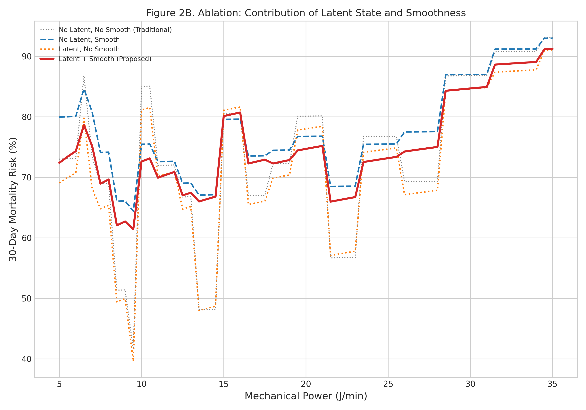

# Dynamic Causal Inference in Healthcare: From Simulation to Intensive Care
### Correcting Time-Varying Confounding via Latent State Modeling

[](https://www.python.org/downloads/)
[](https://pytorch.org/)
[](https://opensource.org/licenses/MIT)

## 📌 Overview

This repository contains the official implementation of the Master's Thesis: **"Dynamic Causal Inference of Mechanical Power in Severe ARDS: A Latent State Modeling Approach."**

We propose a **Continuous-Time Hidden Markov Model (HMM)** framework to address **Time-Varying Confounding** (e.g., Weaning Bias, Sick-Quitter Bias) in longitudinal medical data. This repository consists of two main studies:

1.  **Part I (Methodological Validation):** Verifying the model using a 20-year calibrated **Smoking-CVD Simulation** based on Korean epidemiological profiles (KoGES, KNHANES, KDCA).
2.  **Part II (Clinical Application):** Investigating the dynamic causal effect of Mechanical Power in mechanically ventilated ARDS patients using the **MIMIC-IV** database.

---

## 📐 Methodology: Implementation Details

To overcome the limitations of static models, we implemented a **Dynamic Latent State Model** using PyTorch.

### 1. Latent State Transition (Bias Correction)
We infer a latent physiological state $Z_t$ (e.g., true disease severity) that evolves over time.
The state transition is driven by the previous state, current intervention ($A$), dynamic covariates ($X_{dyn}$), and **static baseline characteristics** ($X_{static}$).

$$Z_t = \psi Z_{t-1} + \gamma_A A_t + \gamma_{dyn} \mathbf{X}_{dyn, t} + \gamma_{static} \mathbf{X}_{static} + \varepsilon_t, \quad \varepsilon \sim \mathcal{N}(0, \sigma_Z^2)$$

### 2. Outcome Model: Detecting Non-Linearity (U-Shape)
The mortality risk $Y_t$ is modeled using a **Piecewise Constant Function** $f(A_t)$ for the intervention (Mechanical Power).

$$\text{logit} P(Y_t=1) = \beta_0 + \beta_Z Z_t + \underbrace{f(A_t)}_{\text{Binned MP}} + \beta_{dyn} \mathbf{X}_{dyn, t} + \beta_{static} \mathbf{X}_{static} + \beta_{time} t$$

* **$f(A_t)$ (Binned MP):** Divides Mechanical Power into $K$ bins. This allows the model to learn flexible, non-linear relationships (e.g., U-shape) instead of forcing a linear assumption.

### 3. Smoothness Regularization (Strength Borrowing)
To prevent overfitting in bins with sparse data, we apply a **Smoothness Penalty**. This forces adjacent bins to have similar coefficients, enabling stable estimation even with limited samples.

$$\mathcal{L} = \mathcal{L}_{\text{NLL}} + \lambda \sum_{k=1}^{K-1} (\beta_{k+1} - \beta_k)^2 + \lambda_{reg} \sigma_Z^2$$

### 4. EM-Style Optimization (Learning Latent Stochasticity)
A naive end-to-end backpropagation approach fails in this setting because computing $Z$ deterministically prevents the state noise parameter ($\sigma_Z$) from receiving proper gradients, causing a mismatch between training and Monte Carlo g-formula simulations. 

To resolve this, we implemented an **Expectation-Maximization (EM)-style training loop**:
* **E-step (Forward Filtering):** The latent state $Z$ is estimated using an approximate Kalman filter. Here, the state noise $\sigma_Z$ directly influences the Kalman gain. The filtered state $Z_{filtered}$ is then **detached** from the computational graph.
* **M-step (Loss Optimization):** The detached $Z_{filtered}$ is used to compute the negative log-likelihood (NLL) and update the outcome parameters. To prevent variance collapse, the transition parameters ($\psi$, $\gamma$) are optimized using a detached MSE loss, while $\sigma_Z$ is rigorously optimized via a decoupled NLL.

---

## 🧬 Part I: Methodological Validation (Simulation)

> **"Can HMM recover true causal effects in the presence of unmeasured confounding?"**

We validated the model using a 20-year **Smoking Cessation & CVD** simulation calibrated to the Korean population. The goal was to correct for "Sick-Quitter Bias" and accurately capture Gene-Environment (GxE) interactions.

### Validation Results (Tables 1-3 & Figure 1)

* **Parameter Recovery:** The proposed HMM successfully recovered the true $\beta_{GS}$ interaction parameter, outperforming standard Markov g-formula and Cox PH models, which suffered from attenuation bias due to unmeasured latent severity.
* **Effect Modification & Urgency of Cessation:**

| A. Effect Modification by Genetic Risk (PRS) | B. Urgency of Smoking Cessation |
| --- | --- |
|  |  |
| Higher genetic risk amplifies the harm of smoking. | Earlier cessation confers substantially greater benefits. |

---

## 🏥 Part II: Clinical Application (Severe ARDS)

> **"Does lower Mechanical Power always lead to better survival?"**

We applied our HMM framework to **17,584 mechanically ventilated ARDS patients** in the MIMIC-IV database. The primary goal is to correct for **Weaning Bias**—where clinicians lower MP for improving patients—which distorts the true causal relationship in standard analyses.

### Clinical Findings (Tables 4-6 & Figures 2-4)

* **Baseline Characteristics (Figure 2 & Table 4):** Successfully stratified patients into Mild, Moderate, and Severe ARDS based on the Berlin Definition. 
* **Optimal Range & U-Shape (Figure 3A & Table 5):** The Proposed Model successfully identified an optimal MP range at **9.5 J/min** showcasing recruitment benefits, fundamentally diverging from the linear "Lower is Better" assumption (~5.0 J/min) of standard Cox PH models.
* **Clinical Impact:** Maintaining MP at the optimal 9.5 J/min compared to a reference of 17 J/min yielded an **Absolute Risk Reduction (ARD) of 11.8%** and a **Number Needed to Treat (NNT) of 8.5**.

| A. Clinical Paradigm Shift | B. Methodological Ablation |
| --- | --- |
|  |  |
| Identifying the optimal MP range (9.5 J/min) against the linear Cox PH assumption. | Demonstrating the necessity of both Latent State and Smoothing components. |

* **Methodological Robustness (Figure 3B):** In the ablation study, the U-shaped morphology remained highly stable across both the fully adjusted Continuous HMM and the standard parametric g-formula ('Proposed w/o Latent State'). The removal of the smoothness penalty ('Proposed w/o Smoothing', $\lambda=0$) resulted in severe overfitting (jagged curves and inflated CI), confirming the necessity of the bin-regularization technique.
* **Subgroup Analysis by Severity (Figure 4 & Table 6):** Stratification revealed distinct morphological shifts in risk trajectories across Mild, Moderate, and Severe ARDS, highlighting the critical need for personalized mechanical ventilation strategies.

---

## 📂 Repository Structure

```text
hmm-gformula-ci/
├── models/                       # [Core] Shared Models
│   ├── dynamic_hmm.py            # Latent State-Space Model for ARDS (v4.0)
│   ├── hmm_gformula.py           # Hidden Markov based g-formula (v3.2)
│   └── baseline_methods.py       # Naive/Pooled Logistic, MSM-IPTW, Time-varying
│
├── study_1_koges_simulation/     # [Part I] Method Validation
│   ├── run_experiments.py        # Exp Integration Suite
│   ├── config.py                 # 20-Year KoGES Calibrated Parameters
│   ├── data_generator.py         # DGP with Time Effects (Aging/Cessation)
│   ├── analysis_advanced.py      # Spline Curves & Bootstrap CI
│   └── results/                  # Tables 1-3 & Figure 1 outputs
│
├── utils/                        # [Utilities] Shared Tools
│   ├── metrics.py                # Bias, RMSE, Coverage, Power
│   └── visualization.py          # Recovery, Convergence & Trade-off Plots
│
└── study_2_ards_mimic/           # [Part II] Clinical Application
    ├── main.py                   # Main Analysis (Tables 5-6, Figs 3-4)
    ├── make_table1.py            # Generates Table 4 (Baseline Characteristics)
    ├── mimic-extract.py          # MIMIC-IV Extraction (Berlin + Gattinoni MP)
    ├── hmm-processing.py         # Tensor Conversion for PyTorch
    └── results/                  # Clinical Output Directory

```

---

## 🚀 Usage

### Requirements

Please ensure you install the required packages. Note that `lifelines` is required for the Cox PH baseline comparison.

```bash
pip install -r requirements.txt
pip install lifelines

```

### 1. Run Simulation Validation (Part I)

```bash
# Run full simulation suite
python study_1_koges_simulation/run_experiments.py --all

# Run advanced causal analysis (Spline Curves with 95% CI)
python study_1_koges_simulation/analysis_advanced.py

```

### 2. Run ARDS Analysis (Part II)

*Note: Access to the MIMIC-IV database is required. Paths must be configured in `mimic-extract.py`.*

```bash
# 1. Preprocessing (Cohort Extraction & Tensor Conversion)
python study_2_ards_mimic/mimic-extract.py
python study_2_ards_mimic/hmm-processing.py

# 2. Generate Table 4 (Baseline Characteristics)
python study_2_ards_mimic/make_table1.py

# 3. Run Main Experiments (HMM Training & Simulation)
python study_2_ards_mimic/main.py

```

---

## 📝 Citation

If you find this code useful, please cite:

> **Kiduk Kim et al**. "Dynamic Causal Inference of Mechanical Power in Severe ARDS: A Latent State Modeling Approach." Master's Thesis, Graduate School of Public Health, Yonsei University, 2026.

```