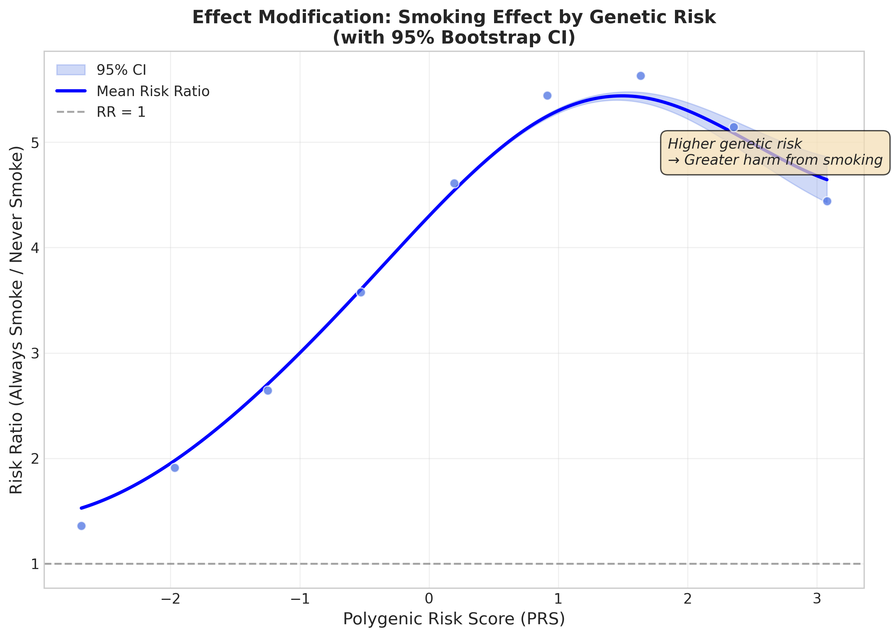
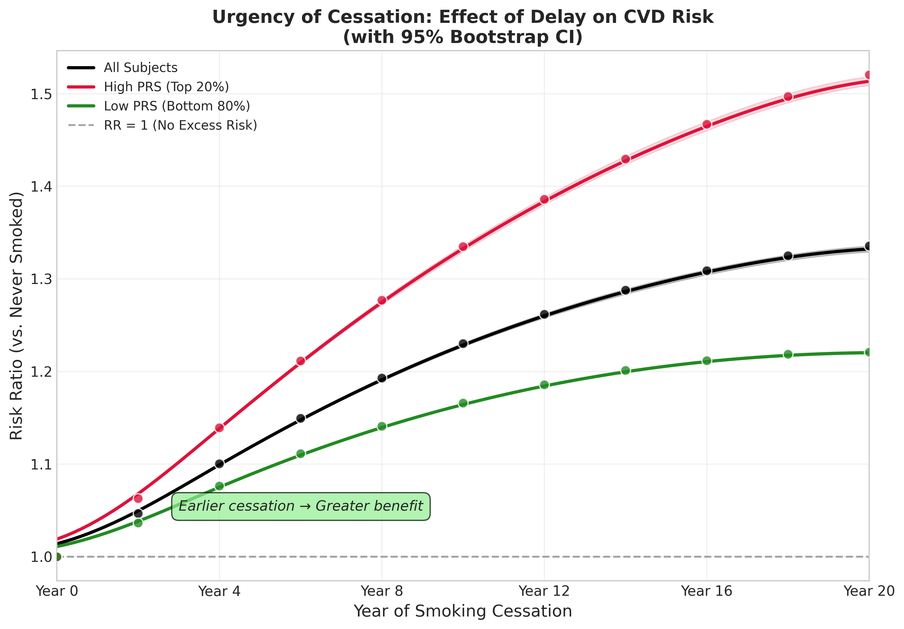
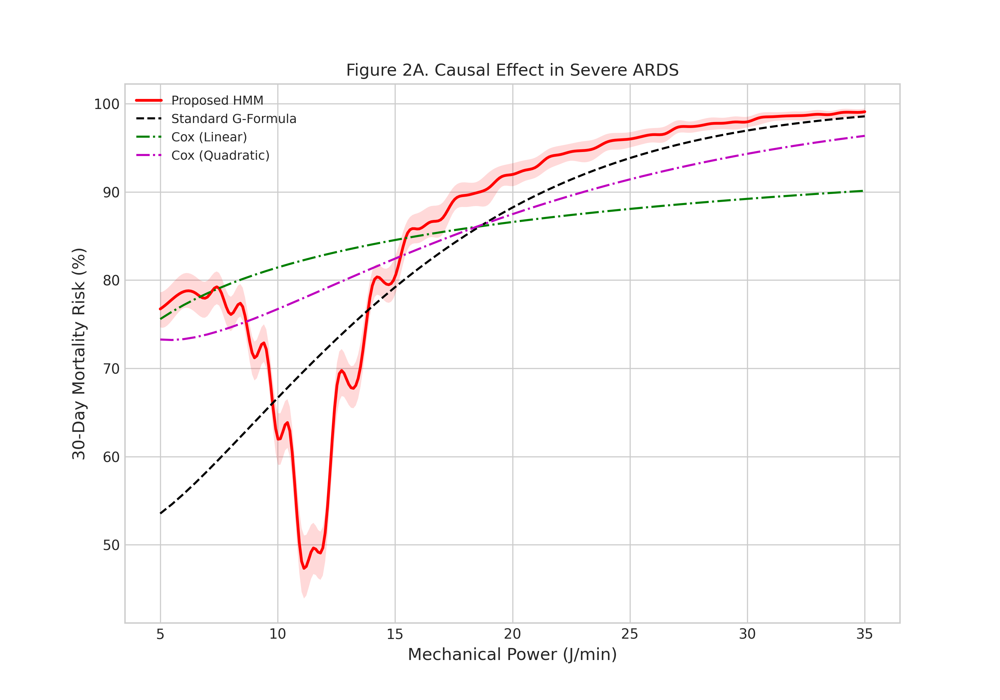
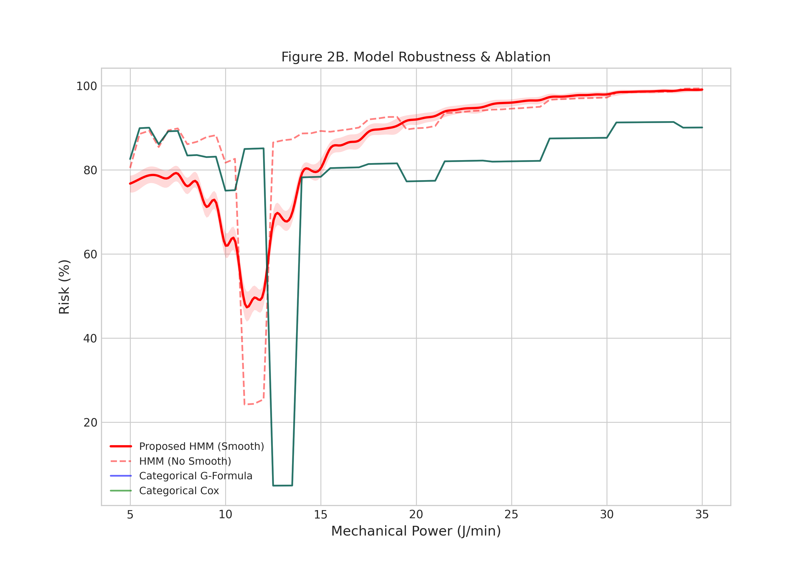

# Dynamic Causal Inference in Healthcare: From Simulation to Intensive Care
### Correcting Time-Varying Confounding via Latent State Modeling

[](https://www.python.org/downloads/)
[](https://pytorch.org/)
[](https://opensource.org/licenses/MIT)

## 📌 Overview

This repository contains the official implementation of the Master's Thesis: **"Dynamic Causal Inference of Mechanical Power in Severe ARDS: A Latent State Modeling Approach."**

We propose a **Continuous-Time Hidden Markov Model (HMM)** framework to address **Time-Varying Confounding** (e.g., Weaning Bias, Sick-Quitter Bias) in longitudinal medical data. This repository consists of two main studies:

1.  **Part I (Methodological Validation):** Verifying the model using a calibrated **Smoking-CVD Simulation**.
2.  **Part II (Clinical Application):** Investigating the causal effect of Mechanical Power in ARDS patients using **MIMIC-IV**.

---

## 📐 Methodology: Implementation Details

To overcome the limitations of static models, we implemented a **Dynamic Latent State Model** using PyTorch.

### 1. Latent State Transition (Bias Correction)
We infer a latent physiological state $Z_t$ (e.g., true lung severity) that evolves over time.
The state transition is driven by the previous state, current intervention ($A$), dynamic covariates ($X_{dyn}$), and **static baseline characteristics** ($X_{static}$).

> **Note:** In the simulation, $X_{static}$ represents Polygenic Risk Scores ($G$). In the ARDS study, it represents baseline demographics (Age, Sex, CCI).

$$Z_t = \sigma(\mathbf{W}_z Z_{t-1} + \mathbf{W}_a A_{t-1} + \mathbf{W}_{dyn} \mathbf{X}_{dyn, t-1} + \mathbf{W}_{static} \mathbf{X}_{static})$$

```python
# models/dynamic_hmm.py

class ContinuousHMM(nn.Module):
    def forward(self, ...):
        # ...
        # Update Latent State (Recurrent Step)
        # Z: Latent State (Severity)
        # G: Represents Static Baseline Features (Age, Sex, CCI)
        # L: Dynamic Covariates (P/F ratio, Compliance)
        
        Z = torch.sigmoid(
            self.psi * Z_prev +       # Previous State (W_z)
            self.gamma_G * G +        # Static Baseline Susceptibility (W_static)
            self.gamma_L(L_curr) +    # Dynamic Physiology (W_dyn)
            self.gamma_cum * C_curr   # Cumulative Exposure Load
        )

```

### 2. Outcome Model: Detecting Non-Linearity (U-Shape)

The mortality risk  is modeled using a **Piecewise Constant Function**  for the intervention (Mechanical Power).

* ** (Binned MP):** Divides Mechanical Power into  bins. This allows the model to learn flexible, non-linear relationships (e.g., U-shape) instead of forcing a linear assumption.

### 3. Smoothness Regularization (Strength Borrowing)

To prevent overfitting in bins with sparse data, we apply a **Smoothness Penalty**. This forces adjacent bins to have similar coefficients, enabling stable estimation even with limited samples ("Strength Borrowing").

```python
# models/dynamic_hmm.py

    def compute_loss(self, ...):
        # 1. Negative Log Likelihood
        logit = self.beta_0 + self.beta_Z * Z + self.beta_bins(target_bin)
        loss_nll = self.criterion(logit, Y)
        
        # 2. Smoothness Regularization (Key for U-Shape Detection)
        # Penalize the difference between adjacent bin coefficients
        diff = self.beta_bins.weight[1:] - self.beta_bins.weight[:-1]
        loss_smooth = self.lambda_smooth * (diff ** 2).sum()
        
        return loss_nll + loss_smooth

```

---

## 🧬 Part I: Methodological Validation (Simulation)

> **"Can HMM recover true causal effects in the presence of unmeasured confounding?"**

Before the clinical application, we validated the model using a **Smoking Cessation & CVD** simulation calibrated to the Korean population (KoGES/KNHANES). The goal was to correct for "Sick-Quitter Bias" (reverse causality where patients quit smoking *because* they get sick).

### Validation Results

* **Curve A (PRS Effect):** Demonstrates how genetic risk modifies the causal effect of smoking.
* **Curve B (Quit Timing):** Quantifies the diminishing benefit of cessation as it is delayed.

| PRS Effect Modification | Quit Timing Urgency |
| --- | --- |
|  |  |

---

## 🏥 Part II: Clinical Application (Severe ARDS)

> **"Does lower Mechanical Power always lead to better survival?"**

We applied our HMM framework to **Severe ARDS patients** in the MIMIC-IV database. Unlike traditional models (Cox, Standard G-formula) that assume a linear relationship ("Lower is Better"), our model identified a distinct **U-Shaped Causal Relationship**.

### Key Findings

* **Optimal Range:** 12–13 J/min (Recruitment Benefit).
* **HMM vs Baselines:** Standard models fail to capture the risk of low MP due to weaning bias.

| Main Result (HMM vs Baselines) | Robustness Check |
| --- | --- |
|  |  |
| **Figure 2A.** The HMM (Red) reveals a U-shape curve, whereas Cox/G-formula (Black/Green) show linear trends. | **Figure 2B.** Comparison with categorical baselines confirms the stability of the HMM's smooth curve. |

---

## 📂 Repository Structure

```bash
hmm-gformula-ci/
├── models/                       # [Core] Shared Models
│   ├── dynamic_hmm.py            # Continuous & Binned HMM (PyTorch)
│   └── baseline_methods.py       # Cox, Logistic, G-formula
│
├── study_1_simulation/           # [Part I] Method Validation
│   ├── main.py                   # Simulation Entry Point
│   ├── config.py                 # Parameters (KoGES Calibrated)
│   ├── modules/                  # Data Generation Logic
│   ├── experiments/              # Experiment Scenarios
│   ├── utils/                    # Metrics & Visualization
│   └── results/                  # Validation Figures
│
└── study_2_ards_mimic/           # [Part II] Clinical Application
    ├── main.py                   # Main Analysis (Fig 2, 3)
    ├── make_table1.py            # Generate Table 1
    ├── preprocessing/            # MIMIC Extraction & Tensor Conversion
    │   ├── mimic_extract.py
    │   └── hmm_processing.py
    └── results/                  # Thesis Figures

```

---

## 🚀 Usage

### 1. Run Simulation Validation (Part I)

```bash
# Run full validation suite (All experiments)
python study_1_simulation/main.py --all

# Run specific advanced analysis (Spline Curves)
python study_1_simulation/main.py --advanced

```

*Outputs will be saved in `study_1_simulation/results/*`

### 2. Run ARDS Analysis (Part II)

*Note: Access to MIMIC-IV database is required.*

```bash
# 1. Preprocessing (Extraction & Tensor Conversion)
python study_2_ards_mimic/preprocessing/mimic_extract.py
python study_2_ards_mimic/preprocessing/hmm_processing.py

# 2. Generate Table 1 (Baseline Characteristics)
python study_2_ards_mimic/make_table1.py

# 3. Run Main Experiments (HMM Training & Simulation)
python study_2_ards_mimic/main.py

```

*Outputs will be saved in `study_2_ards_mimic/results/*`

---

## 📝 Citation

If you find this code useful, please cite:

> **[Author Name]**. "Dynamic Causal Inference of Mechanical Power in Severe ARDS: A Latent State Modeling Approach." Master's Thesis, [University Name], 2026.