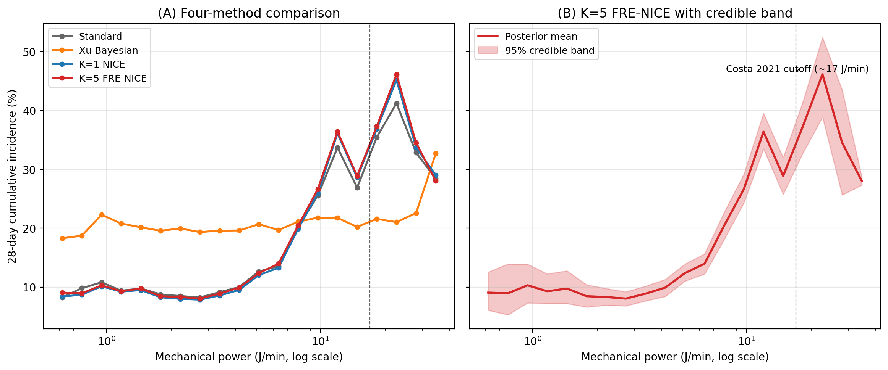
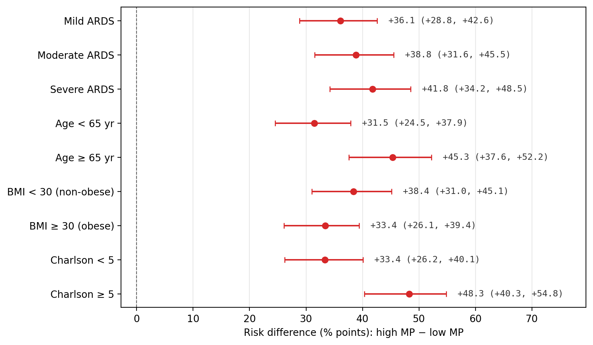

# Bayesian Functional Random-Effect NICE g-formula

[](https://www.python.org/downloads/)
[](https://jax.readthedocs.io)
[](https://num.pyro.ai)
[](https://opensource.org/licenses/MIT)

Causal effect of mechanical power on 28-day mortality in acute respiratory
distress syndrome — a retrospective cohort study using a Bayesian g-formula
with **functional random effects on the outcome hazard**.

---

## Overview

This repository implements a **Bayesian parametric g-formula** (NICE) with a
subject-specific time-varying functional random effect (FRE) on the outcome
hazard, parameterized via a natural cubic spline basis. The functional
random effect itself is not novel: it is mathematically equivalent to the
**random factor smooth** of generalized additive mixed modeling (Wood
2017, `mgcv`) and to the **functional mixed-effects** parameterization of
Guo (2002) and Scheipl, Staicu & Greven (2015). The natural cubic spline
basis is a fixed-basis approximation of the finite-rank random-function
representation in functional data analysis (Yao, Müller & Wang 2005); we
do not employ data-driven eigenfunctions or the PACE algorithm. The
**methodological contribution of this work** is the embedding of this
random factor smooth into the outcome layer of the NICE parametric
g-formula, generalizing Xu et al. (2024)'s scalar random intercept and
integrating the subject-level functional deviation by Bayesian forward
simulation.

The repository accompanies a master's thesis on the dose-response of
mechanical power (MP, J/min) and 28-day in-hospital mortality in ARDS,
estimated on MIMIC-IV v3.1 (N = 17,878 ICU stays, 15,619 unique subjects).

---

## Headline findings

The Bayesian K=5 functional-RE NICE g-formula identifies a **strongly
nonlinear dose-response** of mechanical power on 28-day mortality in ARDS,
with marked acceleration above the Costa et al. (2021) clinical cutoff
of approximately 17 J/min.



Left: four-method overlay on log-MP axis. Standard NICE
(grey, frequentist), K=1 NICE Bayesian (blue), and K=5 FRE-NICE Bayesian
(red) cluster tightly above approximately 6 J/min; the Xu (2024) Bayesian
GLMM (orange, observed-L plug-in) is essentially flat. Dashed vertical
line marks the Costa et al. (2021) 17 J/min clinical cutoff. Right: K=5
posterior mean with 95% credible band.

| MP exposure (J/min) | 28-day mortality (95% CrI) |
|---|---|
| 2.7 (low) | **8.0%** (5.5–11.4) |
| 6.4 | 14.0% (10.6–17.7) |
| 12.0 | 36.4% (30.0–42.4) |
| **18.3** (Costa cutoff, ref) | **37.3%** (32.8–41.4) |
| 22.6 (high) | **46.1%** (38.9–52.4) |

Full per-table and per-figure interpretation is documented in the
manuscript drafts (kept private). Numeric outputs underlying every claim
are in `results/`.

### Framework dominance and natural-course validation

The 25-percentage-point gap between the NICE family and the Xu MSM at
high MP is the **mediated effect through time-varying physiology** that
the NICE forward-$L$ simulation captures and the MSM observed-$L$
plug-in does not. Natural-course validation (predicted cohort-level
mortality under the observed treatment trajectory; raw cohort 25.6%)
confirms this:

| Method | NC predicted | Miss vs raw 25.6% | Calibration |
|---|---|---|---|
| Standard NICE | 24.6% | $-1.0$ p.p. | ✓ |
| K=1 NICE | 25.4% | $-0.2$ p.p. | ✓ |
| **K=5 FRE-NICE** | **25.1%** | **$-0.5$ p.p.** | **✓** |
| Xu Bayesian (MSM) | 29.3% | $+3.7$ p.p. | overshoot |

The NICE-family miss is within ±1 percentage point; the Xu
overshoot is consistent with the framework attenuation argument.

### Bayesian model comparison (WAIC and PSIS-LOO)

Cluster-level (per-subject) log-likelihood across the three Bayesian
methods (Standard is frequentist and excluded). All Pareto-k diagnostics
were ≤ 0.50, indicating reliable PSIS-LOO estimation.

| Method | WAIC | ΔELPD vs K=5 | p_waic |
|---|---|---|---|
| **K=5 FRE-NICE** | **34,404** | 0 (favored) | 4,600 |
| K=1 NICE | 35,686 | −641 | 2,084 |
| Xu Bayesian | 35,676 | −636 | 2,097 |

K=5 is decisively preferred; K=1 and Xu Bayesian are confirmed
mathematically equivalent in fitting (ΔELPD = −4.9).

### Subgroup analysis



All nine pre-specified strata show strong positive risk differences
(high MP minus low MP). Continuous variables are dichotomised at
clinical reference cutoffs: age ≥ 65 yr (older adult), BMI ≥ 30
(WHO Class I obesity, non-Asian definition), Charlson ≥ 5 (high
comorbidity burden). Severity, age, and Charlson gradients amplify
the effect; a BMI obesity-paradox-consistent signal is observed
(non-obese subjects show larger absolute effect than obese).

### Sensitivity and robustness — summary

- **Knot sensitivity** (K = 4, 5, 6): dose-response stable within
  ±0.3 p.p.
- **Spec II ablation** (shared RE on L): |λ_j| ≤ 0.011 for all eight L
  equations — Y-only RE is parsimonious and sufficient.
- **Prior sensitivity** (HalfCauchy(0, 2.5) vs Gamma(2, 0.5) on τ):
  identical to within Monte Carlo noise.
- **Held-out 20% PPC**: day-by-day calibration within ±3 p.p. across
  the 28-day course (day-28 miss −2.6 p.p., predicted 19.5% vs observed
  22.0%).
- **Leave-one-covariate-out (LOCO) on 12 covariates × 3 methods**: the
  dose-response is stable across all proper confounder exclusions.
  PaO₂/FiO₂ ratio (the ARDS-defining variable) is the only exclusion
  producing a large shift (+43 p.p. at the reference bin in all three
  methods, reported as a domain-knowledge sanity check rather than as
  a confounding signal). Lactate is the dominant proper time-varying
  confounder (Standard +7.6, K=1 +9.0, K=5 +8.6 p.p.). Three-method
  concordance supports robustness; the underlying per-covariate risks
  are in `results/loco_K1/` and `results/loco_K5/`.
- **E-value** at the canonical low-vs-reference contrast (bin 7 vs
  bin 16): **8.71** at the point estimate and **7.23** at the
  credible-interval bound — an unmeasured confounder would need to be
  associated with both exposure and outcome by approximately 7-fold to
  fully explain the observed effect.
- **Convergence diagnostics**: across all primary NUTS fits,
  R-hat ≤ 1.08, ESS ≥ 71, and **zero divergent transitions**.

---

## Methodological highlights

### Terminology

- **NICE g-formula** = **N**on-**I**terative **C**onditional **E**xpectation
  algorithm (Bang & Robins 2005; Wen, Hernán & Robins 2021). The Monte-Carlo
  implementation of Robins's (1986) parametric g-formula: rather than
  recursively integrating nested conditional expectations in closed form,
  one *forward-simulates* covariate trajectories under the counterfactual
  treatment regime and averages the resulting outcome predictions across
  the simulated cohort. This is the framework used by methods 1, 3, and 4
  in the ladder below; the Xu (2024) GLMM g-computation (method 2) is
  *MSM-style* in that it plugs in observed (rather than simulated) $L$
  values when computing the counterfactual.
- **FRE** = **F**unctional **R**andom **E**ffect, the time-varying
  generalization of the scalar random intercept of Xu (2024) used in
  methods 3 (K = 1, scalar special case) and 4 (K = 5, primary).

### Estimand and identification

Under sequential exchangeability, positivity, and consistency, the
counterfactual cumulative incidence under sustained MP exposure regime
$\bar a = (a_1, \dots, a_T)$ is

$$
\Pr\{Y^{\bar a}=1\} = \mathbb{E}_V\,\mathbb{E}_{L_1\mid V}\,\cdots
\sum_{t=1}^{T} \Pr(Y_t=1 \mid Y_{t-1}=0,\, \bar L_t,\, V;\, \bar A_t = \bar a_t)
\prod_{s=1}^{t-1}\Pr(Y_s=0\mid\cdot).
$$

### 4-method ladder

| # | Method | RE structure | $L$ handling |
|---|---|---|---|
| 1 | Standard NICE g-formula | none | forward $L$ simulation |
| 2 | Xu Bayesian GLMM (2024) | scalar intercept | observed $L$ plug-in (MSM) |
| 3 | K=1 FRE-NICE | scalar (= Xu RE in NICE framework) | forward $L$ simulation |
| 4 | **K=5 FRE-NICE** (primary) | **functional via spline basis** | forward $L$ simulation |

The outcome model for FRE-NICE is

$$
\mathrm{logit}\,\Pr(Y_t=1\mid\cdot)
= \alpha_0 + \alpha_A^{\top} A_t + \alpha_L^{\top} L_t
+ \alpha_V^{\top} V + b_i^{\top} B(t),
$$

where $B(t)$ is a QR-orthonormalized natural cubic spline basis with knots at
days {0, 3, 7, 14, 21}; $b_i \sim \mathcal{N}(0, \Sigma_b)$ with
$\Sigma_b = \mathrm{diag}(\tau)\,\Omega\,\mathrm{diag}(\tau)$,
$\tau \sim \mathrm{HalfCauchy}(0, 2.5)$, $\Omega \sim \mathrm{LKJ}(2)$.

### Inference

- Bayesian posterior via No-U-Turn Sampler (Hoffman & Gelman 2014) in
  `numpyro` (Bingham et al. 2019). 2 chains × (1,000 warm-up + 1,000 sample),
  target acceptance 0.95.
- Counterfactual dose-response computed by JAX vmap + scan (vectorized over
  posterior × subject × time), $\sim$ 144× speedup over the NumPy reference.
- Cluster-level (per-subject) log-likelihood recorded for WAIC and
  PSIS-LOO model comparison (Watanabe 2010; Vehtari et al. 2017, §4).

---

## Repository layout

```
.
├── data/                               # Cohort CSV (not committed)
├── legacy/                             # Earlier exploration (HMM, VEM-SSM, etc.)
├── results/                            # Posterior states + dose-response + tables
│   ├── bayesian_main_v2/               #   Primary K=5 NUTS posterior
│   ├── bayesian_jax/                   #   Primary dose-response (JAX)
│   ├── knot_sensitivity/               #   K=4, K=6 knot sensitivity
│   ├── loco_K5/, loco_K1/              #   Leave-one-covariate-out (12 each)
│   ├── loglik_main/                    #   Refits with log_lik for WAIC/LOO
│   ├── ppc_K5/                         #   Held-out 20% PPC
│   ├── prior_sens_gamma/               #   Gamma vs HalfCauchy prior sensitivity
│   ├── bayesian_spec2/                 #   Spec II ablation (shared RE on L)
│   ├── subgroup/                       #   9 subgroup dose-response
│   ├── positivity/                     #   Per-bin sample sizes
│   ├── figures/                        #   Manuscript figures (PNG + PDF)
│   ├── standard_v2/                    #   Standard frequentist NICE
│   └── appendix_g/                     #   Standard + Xu LOCO (legacy)
├── scripts/                            # Active analysis scripts
├── src/
│   ├── benchmarks/                     # Method classes
│   ├── data/                           # Cohort assembly (ARDS)
│   └── models/                         # Spline basis, etc.
├── tests/
├── README.md
└── requirements.txt
```

### Active scripts (`scripts/`)

| Script | Purpose |
|---|---|
| `run_bayesian_main.py` | NUTS/SVI fit + dose-response runner; phase-based execution |
| `run_jax_dose.py` | JAX dose-response from saved posterior state |
| `compute_waic_loo.py` | WAIC + PSIS-LOO from saved log_lik states |
| `extract_diagnostics.py` | R-hat / ESS / divergent counts table |
| `make_figures.py` | Dose-response curves, subgroup forest plot |
| `make_table1.py` | Table 1 baseline characteristics |
| `make_holdout_split.py` | Subject-stratified 80/20 holdout for PPC |
| `ppc_holdout.py` | Posterior predictive check on held-out 20% |
| `positivity_check.py` | Per-bin covariate distribution + sample sizes |
| `subgroup_jax_dose.py` | Subgroup-stratified dose-response |
| `validate_bayesian_natural_course.py` | Natural-course calibration |
| `unit_test_numpy_vs_jax.py` | Numerical equivalence test |
| `round2_chain_c.sh` | Orchestrator: 4 NUTS fits + WAIC + diagnostics + PPC |

### Source modules (`src/`)

- `src/data/ards.py` — MIMIC-IV ARDS cohort assembly, 20-bin MP discretization.
- `src/models/spline_glmm.py` — natural cubic spline basis (QR-orthonormalized).
- `src/benchmarks/standard_gformula.py` — frequentist NICE g-formula.
- `src/benchmarks/xu_glmm_bayesian.py` — Bayesian Xu MSM (scalar RE).
- `src/benchmarks/fre_nice_bayesian.py` — Bayesian K=1 / K=5 FRE-NICE g-formula.
- `src/benchmarks/dose_response_jax.py` — GPU-accelerated counterfactual.

---

## Quick start

```bash
# Environment
pip install -r requirements.txt

# Fit primary K=5 (V100 GPU recommended; ~8 min)
python scripts/run_bayesian_main.py \
    --csv data/ards_v31_v4.csv --out-dir results/bayesian_main_v2 \
    --inference nuts --n-warmup 1000 --n-samples 1000 --n-chains 2 \
    --target-accept 0.95 --n-posterior-subset 200 \
    --methods K5 --phase fit

# Dose-response (JAX, ~0.6 min on V100)
python scripts/run_jax_dose.py \
    --csv data/ards_v31_v4.csv --state-dir results/bayesian_main_v2 \
    --out-dir results/bayesian_jax --prefix fre_nice_K5

# WAIC / PSIS-LOO (after K=1, K=5, Xu fits with --record-loglik)
python scripts/compute_waic_loo.py \
    --state-files results/loglik_main/fre_nice_K1_state.npz \
                  results/loglik_main/fre_nice_K5_state.npz \
                  results/loglik_main/xu_bayesian_state.npz \
    --labels "K=1 NICE" "K=5 FRE-NICE" "Xu Bayesian" \
    --out-md results/loglik_main/waic_loo_table.md

# All sensitivity analyses (full overnight pipeline)
bash scripts/round2_chain_c.sh
```

---

## Reproducibility

- **Data**: MIMIC-IV v3.1 (PhysioNet credentialed access). Cohort assembly
  in `src/data/ards.py`; the resulting CSV is not redistributed.
- **Random seeds**: fixed in all scripts (default 0, with method-specific
  offsets).
- **Numerics**: `jax_enable_x64` is forced on for dose-response computation
  to ensure NumPy-equivalent precision.
- **Convergence**: across all primary NUTS fits, R-hat ≤ 1.08 and zero
  divergent transitions.
- **Posterior states (FRE weights)** for all primary fits and sensitivity
  analyses are saved as `results/**/*_state.npz` (32 of 35 committed; the
  three loglik-recording states exceed GitHub's 100 MB limit and are
  gitignored — regenerate with `--record-loglik`).

---

## Citing

If using this codebase, please cite the master's thesis (forthcoming) and
the methodological anchors:

- Robins, J. M. (1986). A new approach to causal inference in mortality
  studies with a sustained exposure period. *Mathematical Modelling*, 7,
  1393–1512.
- Xu, Y., et al. (2024). GLMM-based g-computation for clustered
  longitudinal data. *Biometrics*, 80(3), ujae100.
- Yao, F., Müller, H.-G., & Wang, J.-L. (2005). Functional data analysis
  for sparse longitudinal data. *JASA*, 100, 577–590.
- Wood, S. N. (2017). *Generalized Additive Models: An Introduction with R*
  (2nd ed.). CRC Press.
- Costa, R., et al. (2021). Mechanical power and 28-day mortality in
  mechanically ventilated patients. *AJRCCM*, 204(3), 303–311.

---

## License

MIT — see [LICENSE](LICENSE) (if absent, MIT is intended; please confirm
with the maintainer).
